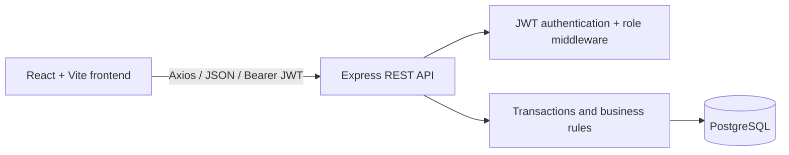

# Mini Operations ERP - Technical Documentation

# Live Link
https://fronend-crm-erp.onrender.com

## 1. Project purpose

Mini Operations ERP is a multi-location inventory application for an operations team. It tracks material by item, location, and batch; calculates stock availability; lets Admin create work orders; lets Operations transfer stock; and lets Sales reserve stock for customer orders.

The core business flow is:

```text
Inventory → Work Order → Stock Check → Internal Transfer / Shortage → Customer Reservation
```

## 2. Architecture



### Technology choices

| Layer | Implementation | Purpose |
|---|---|---|
| Frontend | React 18, Vite, React Router, Axios | Responsive browser UI, protected routes, API calls |
| Backend | Node.js, Express 5 | REST API and role-based business operations |
| Database | PostgreSQL via `pg` | Relational storage, row locks, transactions, constraints |
| Authentication | `jsonwebtoken`, `bcryptjs` | Password verification and JWT access/refresh tokens |
| Security | Helmet, CORS | Safer HTTP headers and configured browser origin access |
| Tests | Node built-in test runner | API/database integration scenarios |

## 3. Roles and permissions

`ADMIN` bypasses normal role gates. The remaining role permissions are enforced in backend route middleware.

| Module/action | Admin | Operations | Sales |
|---|---:|---:|---:|
| Login/profile | Yes | Yes | Yes |
| View inventory and available stock | Yes | Yes | Yes |
| Create stock adjustments | Yes | Yes | No |
| Create work order | Yes | No | No |
| View/update work order status | Yes | Yes | No |
| Request/dispatch/receive transfer | Yes | Yes | No |
| Create/cancel customer order reservation | Yes | No | Yes |

## 4. Inventory rules

Each inventory record belongs to exactly one item, location, and batch.

```text
available_quantity = physical_quantity - reserved_quantity
```

Rules implemented:

1. Physical and reserved values cannot be negative because the database has `CHECK` constraints.
2. Reserved quantity cannot exceed physical quantity.
3. Manual OUT adjustments cannot exceed currently available stock.
4. Every manual adjustment includes a unique idempotency key.
5. The backend uses `BEGIN`, `COMMIT`, `ROLLBACK`, and `SELECT ... FOR UPDATE` for stock-changing work.
6. Customer reservations lock inventory rows before rechecking availability, preventing two simultaneous reservations from overselling the same stock.

## 5. Work-order logic

An Admin creates a work order with:

- Work Order Number
- Location
- Item
- Required Quantity
- Assigned Admin/Operations user
- Status: `ASSIGNED`, `IN_PROGRESS`, or `COMPLETED`

The API calculates availability across batches at the requested location and returns:

```text
shortage_quantity = max(required_quantity - available_quantity, 0)
```

Creating a work order does not change stock; it reports whether material is sufficient or short.

## 6. Internal-transfer logic

Transfer statuses:

```text
REQUESTED → DISPATCHED → RECEIVED
```

| State change | Inventory effect |
|---|---|
| Request transfer | No stock change |
| Dispatch transfer | Source physical quantity decreases after source availability check |
| Receive transfer | Destination physical quantity increases |

Important safeguards:

- Source and destination must be different locations.
- The selected batch must belong to the selected item.
- Dispatch fails when source available inventory is insufficient.
- Receipt is allowed only from `DISPATCHED` status.
- A second receipt receives `409 Conflict`, so destination stock cannot be increased twice.

## 7. Customer orders and reservations

Sales and Admin users create customer orders. An order contains a customer name and one or more inventory records with requested quantities.

Creation process:

1. Validate request values and reject duplicate inventory lines.
2. Sort inventory rows and lock them with `FOR UPDATE`.
3. Recalculate available quantity inside the same database transaction.
4. Reject the full request when any requested amount exceeds available stock.
5. Create the order and its items.
6. Increase `reserved_quantity` and record `RESERVATION` transactions.
7. Commit all changes together.

Cancelling a `RESERVED` order locks its inventory records, decrements `reserved_quantity`, writes `RESERVATION_RELEASE` transactions, and sets the order to `CANCELLED`.

## 8. Database design

Main relationships:

```text
Category → Item → Batch → Inventory ← Location
Inventory → InventoryTransaction
Location + Item → WorkOrder
Location + Item + Batch → InternalTransfer
CustomerOrder → CustomerOrderItem → Inventory
User → WorkOrder / Transfer / CustomerOrder / InventoryTransaction
```

The executable PostgreSQL schema is `backend/db/001_operations_erp_foundation.sql`.

The dbdiagram.io DBML source is `backend/docs/operations-erp.dbml`.

## 9. Authentication

### Login flow

```text
LoginPage → POST /api/auth/login → bcrypt password comparison
→ access + refresh JWT returned → browser localStorage
→ Axios sends Authorization: Bearer <access-token>
```

The Axios interceptor attempts one refresh after a `401`. If refresh fails, it clears local storage and redirects to login.

### Auth endpoints

| Method | Endpoint | Request | Result |
|---|---|---|---|
| POST | `/api/auth/login` | `username`, `password` | Access token, refresh token, user |
| POST | `/api/auth/refresh` | `refresh` | Fresh access token |
| POST | `/api/auth/logout` | `refresh` | Revokes demo refresh token in memory |
| GET | `/api/auth/me` | Bearer token | Current user |

## 10. API reference and Postman setup

Base URL locally:

```text
http://localhost:8000/api
```

Create a Postman environment with:

```text
base_url = http://localhost:8000/api
access_token =
refresh_token =
```

### Postman login request

```http
POST {{base_url}}/auth/login
Content-Type: application/json

{
  "username": "admin",
  "password": "<seed password>"
}
```

In the **Tests** tab of the login request, save tokens:

```javascript
const data = pm.response.json();
pm.environment.set('access_token', data.access);
pm.environment.set('refresh_token', data.refresh);
```

For protected requests, add:

```text
Authorization: Bearer {{access_token}}
```

### API endpoint table

| Method | Endpoint | Allowed role | Request/body summary |
|---|---|---|---|
| GET | `/health` | Public | Health response |
| POST | `/auth/login` | Public | Username/password |
| POST | `/auth/refresh` | Public | Refresh token |
| POST | `/auth/logout` | Any signed-in user | Refresh token |
| GET | `/auth/me` | Any signed-in user | No body |
| GET | `/meta/categories` | Any signed-in user | No body |
| GET | `/meta/locations` | Any signed-in user | No body |
| GET | `/meta/items` | Any signed-in user | No body |
| GET | `/meta/batches?item_id=:id` | Any signed-in user | Item ID query parameter |
| GET | `/meta/assignable-users` | Any signed-in user | No body |
| GET | `/inventory` | Admin/Operations/Sales | Optional `location_id`, `category_id`, `item_id`, pagination |
| GET | `/inventory/transactions` | Admin/Operations | Pagination |
| POST | `/inventory/adjustments` | Admin/Operations | `inventory_id`, `direction`, `quantity`, `idempotency_key` |
| GET | `/work-orders` | Admin/Operations | Optional status/location filters |
| POST | `/work-orders` | Admin | `location_id`, `item_id`, `required_quantity`, `assigned_user_id` |
| PATCH | `/work-orders/:id/status` | Admin/Operations | `status` |
| GET | `/transfers` | Admin/Operations | Optional status filter |
| POST | `/transfers` | Admin/Operations | Source/destination, item, batch, quantity |
| POST | `/transfers/:id/dispatch` | Admin/Operations | No body |
| POST | `/transfers/:id/receive` | Admin/Operations | No body |
| GET | `/orders` | Admin/Sales | Optional status filter |
| POST | `/orders` | Admin/Sales | Customer, items, idempotency key |
| POST | `/orders/:id/cancel` | Admin/Sales | No body |

### Postman bodies

```json
// POST {{base_url}}/inventory/adjustments
{
  "inventory_id": 1,
  "direction": "IN",
  "quantity": 5,
  "idempotency_key": "inventory-adjustment-001"
}
```

```json
// POST {{base_url}}/work-orders
{
  "location_id": 1,
  "item_id": 1,
  "required_quantity": 100,
  "assigned_user_id": 2
}
```

```json
// POST {{base_url}}/transfers
{
  "source_location_id": 1,
  "destination_location_id": 2,
  "item_id": 1,
  "batch_id": 1,
  "quantity": 5
}
```

```json
// POST {{base_url}}/orders
{
  "customer_name": "Acme Distribution",
  "idempotency_key": "customer-order-001",
  "items": [
    { "inventory_id": 1, "quantity": 5 }
  ]
}
```

### API errors

| Status | Meaning |
|---|---|
| `400` | Invalid request, insufficient stock, or business validation failure |
| `401` | Missing/invalid access token |
| `403` | Signed-in user lacks required role |
| `404` | Resource does not exist |
| `409` | Duplicate request or invalid repeated state transition |
| `500` | Unexpected server/database error |

## 11. Setup and deployment

### Local setup

1. Create a PostgreSQL database.
2. Set backend `DATABASE_URL` and JWT secrets in `backend/.env`.
3. Run `npm install`, `npm run db:init`, then `npm run seed` in `backend`.
4. Set `VITE_API_BASE_URL` in `frontend/.env`.
5. Run backend with `npm run dev` and frontend with `npm run dev`.

### Render deployment

Backend web service:

```text
Build command: npm install
Start command: npm start
Health check: /api/health
```

Configure all backend variables in Render; never commit `.env`. Set `CORS_ORIGIN` to the deployed frontend URL.

Frontend static site:

```text
Build command: npm install && npm run build
Publish directory: dist
VITE_API_BASE_URL: https://<your-backend>/api
```

## 12. Automated testing

`backend/tests/operations.integration.test.js` contains the five required tests:

1. Cannot reserve beyond available inventory.
2. Cannot transfer beyond available inventory.
3. Destination quantity changes only after receipt.
4. Same transfer cannot be received twice.
5. Unauthorized Sales user cannot create a transfer.

Run them only with a disposable database:

```powershell
cd backend
$env:TEST_DATABASE_URL = 'postgresql://...'
npm test
```

## 13. Important code map

| File | Responsibility |
|---|---|
| `backend/src/server.js` | Express middleware, CORS, API route registration |
| `backend/src/middleware/auth.js` | JWT authentication and role authorization |
| `backend/src/services/authService.js` | bcrypt login and JWT token generation |
| `backend/src/services/dbHelpers.js` | Pagination and PostgreSQL transaction helper |
| `backend/src/controllers/inventoryController.js` | Inventory listing and safe manual adjustments |
| `backend/src/controllers/workOrderController.js` | Work-order creation and shortage query |
| `backend/src/controllers/transferController.js` | Request, dispatch, and receipt transfer logic |
| `backend/src/controllers/orderController.js` | Customer reservations and cancellation release |
| `backend/db/001_operations_erp_foundation.sql` | PostgreSQL tables, checks, references, indexes |
| `backend/tests/operations.integration.test.js` | Required API/database test scenarios |
| `frontend/src/services/api.js` | Axios base URL, JWT header, refresh retry |
| `frontend/src/context/AuthContext.jsx` | Login/session/logout state |
| `frontend/src/pages/InventoryPage.jsx` | Inventory UI and adjustments |
| `frontend/src/pages/WorkOrdersPage.jsx` | Work-order UI and shortage display |
| `frontend/src/pages/TransfersPage.jsx` | Internal-transfer UI |
| `frontend/src/pages/CustomerOrdersPage.jsx` | Reservation and cancellation UI |
