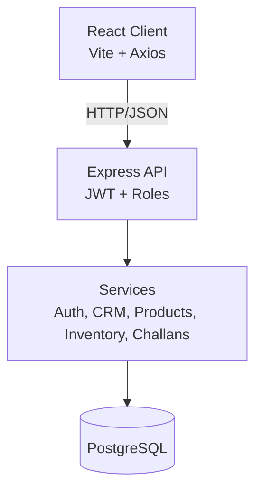

# Mini ERP + CRM Operations Portal Documentation

## Overview
This repository implements a wholesale/distribution ERP and CRM portal with a React Vite frontend and a Node.js Express backend backed by PostgreSQL.

The system supports:
- JWT authentication
- Role-based access control
- Customer CRM management
- Product and warehouse management
- Stock movement tracking
- Sales challan draft/confirm/cancel flows
- Product snapshots for challan history
- Dashboard statistics

## Architecture



## Tech Stack
- Frontend: React, Vite, React Router, Axios
- Backend: Node.js, Express, pg, bcryptjs, jsonwebtoken, cors, helmet, morgan, dotenv
- Database: PostgreSQL

## Repository Layout
- `backend/` Express API and seed script
- `frontend/` React admin UI
- `docs/` API collection files
- `DOCUMENTATION.md` this file

## Backend Runtime
- Entry point: `backend/src/server.js`
- Environment: `backend/.env`
- Health endpoint: `GET /api/health`

## Authentication
- `POST /api/auth/login`
- `POST /api/auth/refresh`
- `POST /api/auth/logout`
- `GET /api/auth/me`

JWT access tokens are returned from login and attached by the frontend on API requests. Refresh tokens are kept in browser storage for the demo implementation.

## Roles
- Admin: full access
- Sales: customers and challans
- Warehouse: products and inventory
- Accounts: read access to operational data

## Core Modules
### Customers
- Search by name, mobile, email, business name, GST
- Create, update, view, delete
- Follow-up notes
- Pagination and filters

### Products
- CRUD for products, categories, warehouses
- Low-stock visibility
- Search and filtering

### Inventory
- IN and OUT stock movements
- Prevent negative stock
- Transactional updates

### Challans
- Draft challans do not reduce stock
- Confirmed challans reduce stock and create OUT movements
- Challan items store product snapshots
- Insufficient stock rolls back the whole operation

### Dashboard
- Customer counts
- Product counts
- Low-stock counts
- Draft and confirmed challan counts
- Recent records tables

## Setup
### Backend
```bash
cd backend
npm install
copy .env.example .env
npm run seed
npm run dev
```

### Frontend
```bash
cd frontend
copy .env.example .env
npm install
npm run dev
```

## Environment Variables
### Backend
- `PORT`
- `NODE_ENV`
- `DATABASE_URL`
- `JWT_ACCESS_SECRET`
- `JWT_REFRESH_SECRET`
- `JWT_ACCESS_EXPIRES_IN`
- `JWT_REFRESH_EXPIRES_IN`
- `CORS_ORIGIN`

### Frontend
- `VITE_API_BASE_URL`

## Demo Credentials
- Admin: `admin` / `Admin@12345`
- Sales: `sales1` / `Sales@12345`
- Warehouse: `warehouse1` / `Warehouse@12345`
- Accounts: `accounts1` / `Accounts@12345`

## Deployment Notes
- Frontend can be deployed on Vercel or Netlify.
- Backend can be deployed on Render or another free-compatible Node host.
- PostgreSQL can be hosted on Supabase or Neon.
- Production backend entrypoint: `node src/server.js`

## API Notes
The React frontend expects the backend under `/api`. Keep that prefix stable if you change deployment paths.

## Maintenance Notes
- Keep `.env` out of git.
- Keep JWT secrets unique per environment.
- Use the seed script only for demo or reset workflows.
